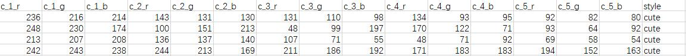
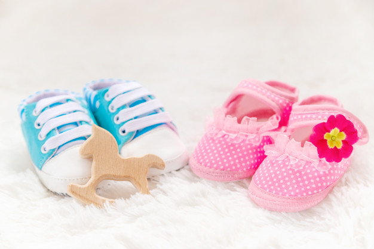
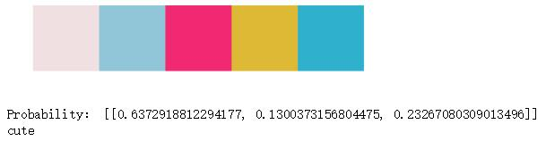
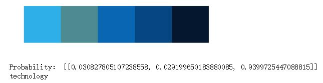

# Style_classifier
This repository trained a classifier to differentiate different style of color scheme, such as cute, fresh or technology.
## Image Crawler
### Prerequisite

The following libraries are required
```
pip install colorthief
pip install chardet
pip install http
```

### Usage

The images used to train the classifier are crawled from <a href="https://www.shutterstock.com/">ShutterStock<a/>. Three types of images are collected, including 'cute', 'fresh', 'technology'.

If you want to crawl more types of images, add your url in ditc 'url', and then add a tag to list 'style':

```
    styles=['technology','cute','fresh']
    url={
        'cute':'https://www.shutterstock.com/search/cute+pink?mreleased=false',
        'technology':'https://www.shutterstock.com/search/fresh+green?mreleased=false',
        'fresh':'https://www.shutterstock.com/search/technology+blue+future?mreleased=false'
    }
 ```

Change the PATH and DATA_FILENAME to where you want to save your data:

```
# where to save your data
PATH="./data/"
DATA_FILENAME="train_tech.csv"
```

And then run the following command, note that every page contains about 100 images, the Tag is the temporary file name to store the images.
> python ./Image_Crawler.py startPage endPage Tag

For example:

> python ./Image_Crawler.py 1 100 1

 The images are stored in the 'data' folder. And also, the color scheme (palette) is extracted using <a href="https://github.com/fengsp/color-thief-py">Color Theif</a>. Each palette is composed of 5 rgb colors, and stored in DATA_FILENAME, which looks like this:
 
 
 
 ## Data 
 
 ## Color Extraction with Color Thief
 
 Below is a example of color scheme extraction.
 
 Image:
 
 
 
 Extracted color scheme:
 
 
 
 ## Classfier
 The classifer is trained using lightGBM. The data set has 15 features(5*3 rgb). The Accuracy of the model is arround 0.9263. Any suggestion to improve the model would be appreciated:blush:.
 The parameters used to train lightGBM model are as follows:
 ```
# specify your configurations as a dict
params = {
    'boosting_type': 'gbdt',
    'objective': 'multiclass',
    'metric': {'multi_error'},
    'learning_rate': 0.01,
    'feature_fraction': 0.7,
    'bagging_fraction': 0.7,
    'bagging_freq': 4,
    'num_class':3,
    'num_leaves':400,
    'max_depth':10,
    'max_bin':30
}
```
 The detailed code is in the 'classifyPalette.ipynb' notebook. If you are not interested in the detailed training process, you can also use 'stylePredict.py' to do color scheme pridiction.
 
 ## Usage
 ### Prerequisite
 make sure you have the following module installed:
 ```
 pip install lightgbm
 pip install colorthief
 pip install pandas
 ```
  Download model.txt and stylePredict.py and you can use the style_predict function to predict color scheme style. The parameter is a list of 5 rgb tuples(eg：[(r,g,b),(r,g,b),(r,g,b),(r,g,b),(r,g,b)]). And it returns three styles ['cute','fresh','technology'].
  
  Hear is two examples:
  
  Image:
  
  

  Palette: [(240, 224, 225),(144, 198, 216),(241, 40, 114),(221, 185, 54),(47, 177, 205)]
  
  Predictions:
  
  
  
  
  Image:
  
  

  Palette: [(46, 175, 231), (76, 140, 144), (9, 102, 179), (6, 71, 130), (4, 23, 47)]
  
  Predictions:
  
  
  
  
  Because the color schemes extracted from images of different style may only differentiate slightly from each other, it's difficult for the classifier to distinguish these palettes. Given a better dataset, the results may improve a lot.

 
